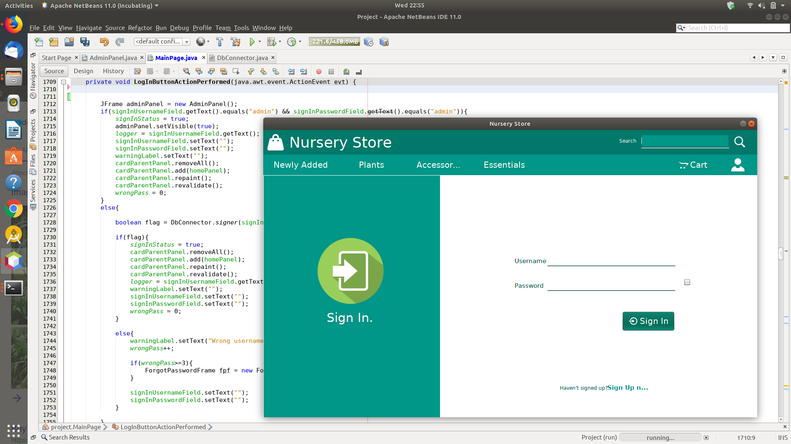

# Inventory-Management-or-E-commerce-Software
A simple E-commerce Software build with JAVA and SQLite using Apache Netbeans IDE.

**Sample Screenshot:**

**Features:**

- Cart  
-   Category Wise Panels  
-   Sign Up/Sign In   
-   Password Recovery 
-   New Product Entry   
-   Stock Update   
-   Billing details etc.

**CAUTION:**
- THIS PROJECT IS DEVELOPED ON BOTH WINDOWS & LINUX ENVIRONMENT USING NETBEANS IDE 11.0 / April 4, 2019
- FOR PICTURES THERE ARE THREE DIFFERENT FOLDERS IN 'Project/src/products' AS PER CATEGORY. 
- FOR NEW ENTRY, NEW PICTURES SHOULD   BE PLACED AS PER THEIR CATEGORY.
- TO SIGN INTO ADMIN PANEL SIGN IN AS "username: admin, password: admin"
- This project is not built from Scratch as it developed by using various samples. Multiple Mismatch of Variable and Identifier's may Arise !
